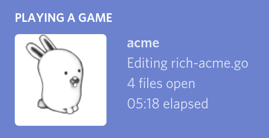

# Discord Rich Presence for Acme



This program displays the name of the file you're editing in Acme as your presence on Discord.

## How do I use it?

```
go get -u github.com/erebid/rich-acme
# open acme, start editing some files
rich-acme
```

## Why?

I made this as a joke, and also to try out
[9fans' excellent Go package](https://9fans.net/go/acme)
for interfacing with Acme.

## Should I use it?

I don't use it, because it's pointless.

You shouldn't use it either. I recommend you do something better with
your time than configuring your text editor to flaunt that you've been
editing a glorified "hello world" program written in C++ for three hours.
